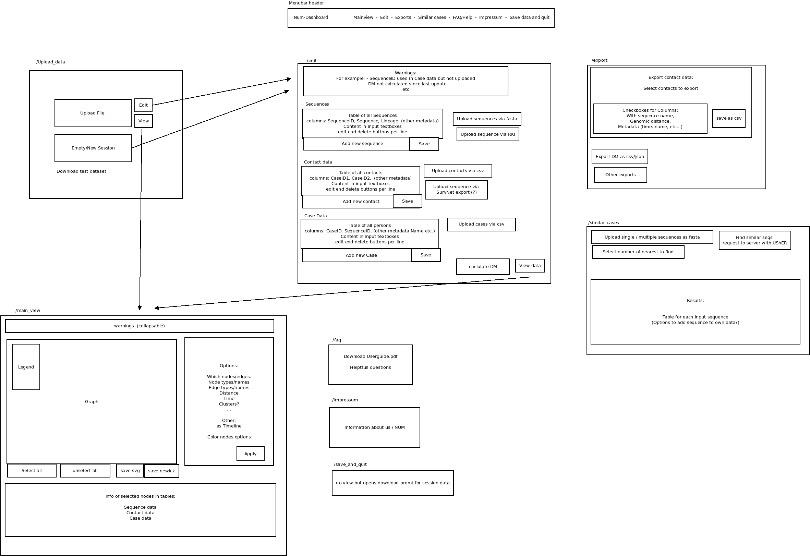

# num-dashboard

## General Setup

### Conda
Install libraries via [conda](https://docs.conda.io/en/latest/miniconda.html).
Create environment and install packages:

    conda create -n num-dash
    conda install -c anaconda flask
    conda install -c conda-forge uwsgi
    conda install -c bioconda nextclade
    conda install -c bioconda samtools
    conda install -c anaconda biopython
    conda install -c bioconda ucsc-fatovcf
    conda config --add channels defaults
    conda config --add channels bioconda
    conda config --add channels conda-forge
    conda install usher

or import the environment from environment.yaml:

    conda env create -f environment.yaml

If you change the environment export a new yaml file:

    conda env export > environment.yaml

### Datasets and Scripts

Download the Nextclade Covid dataset:

    nextclade dataset get --name 'sars-cov-2' --output-dir 'datasets/nextclade_covid/'

Change modes of scripts

    chmod +x scripts/nextclade.sh
    chmod +x scripts/usher_nearest_k.sh
    chmod +x scripts/IMS_to_fasta.sh

Download the RKI datasets:

    cd datasets/RKI
    
    wget https://github.com/robert-koch-institut/SARS-CoV-2-Sequenzdaten_aus_Deutschland/raw/master/SARS-CoV-2-Sequenzdaten_Deutschland.fasta.xz
    unxz SARS-CoV-2-Sequenzdaten_Deutschland.fasta.xz
    samtools faidx SARS-CoV-2-Sequenzdaten_Deutschland.fasta

    wget https://github.com/robert-koch-institut/SARS-CoV-2-Sequenzdaten_aus_Deutschland/raw/master/SARS-CoV-2-Sequenzdaten_Deutschland.csv.xz
    unxz SARS-CoV-2-Sequenzdaten_Deutschland.csv.xz

## Run locally

    cd <path>/num-dashboard
    conda activate num-dash

    export FLASK_ENV=development
    export FLASK_APP=main_site.py

    flask run

Open 'http://127.0.0.1:5000/' in your browser of choice.

## Run on server

### Setup

Set up the flask server with uwsgi and nginx mostly following [this tutorial](https://www.digitalocean.com/community/tutorials/how-to-serve-flask-applications-with-uwsgi-and-nginx-on-ubuntu-22-04). \
Create a [socket](https://stackoverflow.com/questions/6025755/how-to-create-special-files-of-type-socket). \
[This](https://forum.nginx.org/read.php?11,290332) might be helpful.

The system services are located here: `/etc/systemd/system`.

    [Unit]
    Description=uWSGI instance to serve dashboard
    After=network.target

    [Service]
    User=ubuntu
    Group=www-data
    WorkingDirectory=/home/ubuntu/num-dashboard
    ExecStart=/home/ubuntu/miniconda3/envs/num-dash/bin/uwsgi --ini main_site.ini

    [Install]
    WantedBy=multi-user.target

The ini file in the directory of this repository:

    [uwsgi]                                                                                                                                   
    wsgi-file = main_site.py                                              
    callable = app

    master = true                                                 
    processes = 5

    socket = /home/ubuntu/num-dashboard/mainsocket.sock
    chmod-socket = 660
    vacuum = true
    buffer-size = 64000

    die-on-term = true

The nginx config at `/etc/nginx/sites-available/dashboard`:

    server {
        listen 80;
        server_name gensurv-ph.bi.denbi.de;

        location / {
            include uwsgi_params;
            uwsgi_pass unix:/home/ubuntu/num-dashboard/mainsocket.sock;
        }
    }

### Maintain

#### Conda

On the Server use the conda environment `num-dash`. When adding new packages, add them to the `environment.yaml` file and the documentation above.

When the `environment.yaml` was updated when pulling the repository use this to update the enviroment on the server

    conda env update -f environment.yaml

#### New commits

After pushing a new commit, pull on the server. Then restart the dashboard service:

    sudo systemctl restart dashboard

The status can be checked with:

    sudo systemctl status dashboard -n 50

TODO: implement CI/CD elements to automate this

## Links

[Ideas](https://docs.google.com/document/d/1wGQjhyARwbIx12TZwm1rZmsHJ9wGqqF6jZ6zu76jKRQ/edit?usp=sharing)

## Planned page layout

