# Survnet Import
Auf dieser Seite wird die Schnittstelle zum SurvNet erläutert.
Dabei lernen Sie zunächst, wie Sie die Abfragen im SurvNet generieren,
sodass die daraus resultierenden Daten in GenTrain eingespeist werden können.
Wie Sie diese Abfragen für den späteren Gebrauch abspeichern und die resultierenden Daten in GenTrain einspeisen können.
Und, wie Sie zu einem späteren Zeitpunkt die Abfragen in SurvNet wiederfinden können.
Das folgende Video geht auf den gesamten Prozess ein, alternativ - oder zum späteren Nachschlagen -
können Sie die unten stehende Anleitung konsultieren.

## Inhaltsverzeichnis

1. [Video-Anleitung](#video-anleitung)
2. [Abfragenbau in SurvNet](#abfragenbau-in-survnet)
    1. [Falldaten-Abfrage](#falldaten-abfrage)
    2. [Kontaktdaten-Abfrage](#kontaktdaten-abfrage)
3. [SurvNet Abfragen wiederfinden](#survnet-abfragen-wiederfinden)
4. [Datenimport in GenTrain](#datenimport-in-gentrain)

## Video-Anleitung

<video src="https://youtu.be/TDSiRImxqvU" width="320" height="240" controls></video>

## Abfragenbau in SurvNet

Starten Sie SurvNet und öffnen, in der linken oberen Ecke des Fensters,
mit einem Linksklick auf den blauen Knopf mit SurvNet Logo das Drop-Down-Menü.

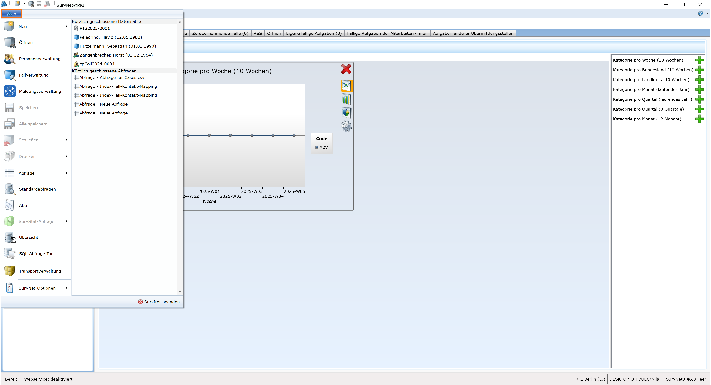

Klicken Sie nun etwas weiter unten innerhalb dieses Menüs auf das Feld „Abfrage“,
woraufhin sich eine Registerkarte zum Erstellen einer neuen Abfrage öffnet.

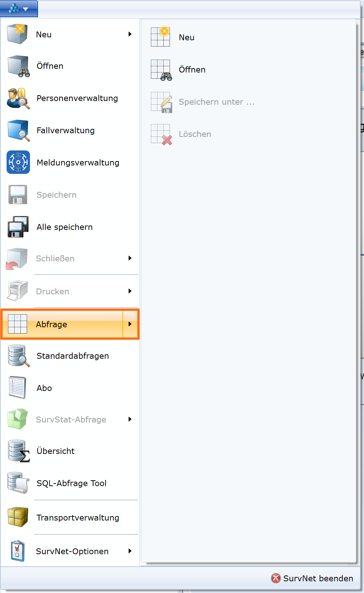

### Falldaten-Abfrage

Zunächst wollen Wir eine Abfrage für die Falldaten erstellen.
Geben Sie hierfür zunächst den Namen im Feld „Abfragename“ ein,
unter welchem diese gespeichert und später wieder aufgefunden werden können soll, beispielsweise „GenTrain Falldaten“.
In den darunterliegenden Feldern Kontext und Beschreibung können Sie,
falls Sie wünschen, weitere Informationen zu dieser Abfrage vermerken.

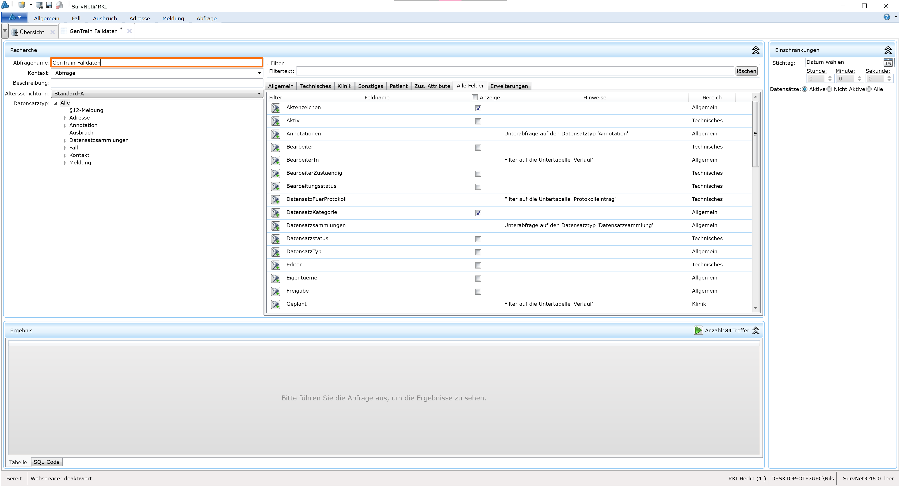

Wählen Sie als Nächstes aus der Liste „Datensatztyp“ unter „Fall“ den Datensatz zu dem Erreger aus,
welchen Sie mit GenTrain analysieren möchten. Für unser Beispiel nutzen Wir dazu einen COVID-19 Datensatz.

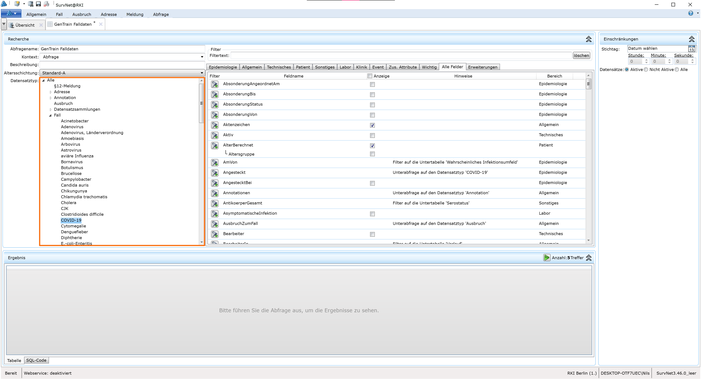

Nun wählen Wir aus, welche Felder exportiert werden sollen, dies geschieht rechts neben der „Datensatztyp“ List.
Damit Wir uns langes Suchen nach den richtigen Feldern ersparen,
nutzen Wir die Suchzeile „Filtertext“ über der Felderliste.

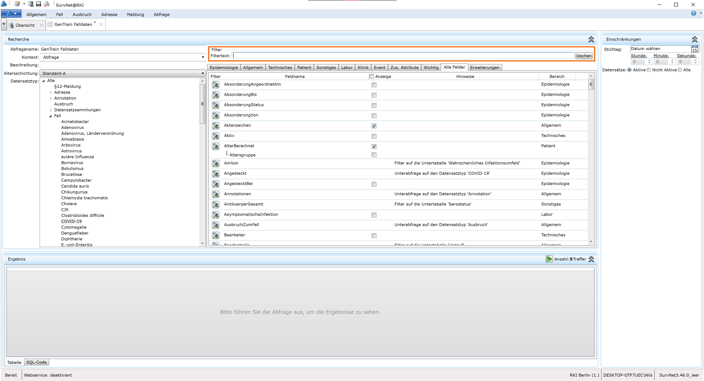

Um alle Felder finden zu können müssen Wir uns in der Kategorie „Alle Felder“ befinden,
dies ist beim Anlegen einer neuen Abfrage standardmäßig der Fall.
Sollten Sie sich nichtsdestotrotz in einer anderen Kategorie befinden,
so wählen sie im Reiter unter dem Suchfeld die Registerkarte mit dem Titel „Alle Felder“.

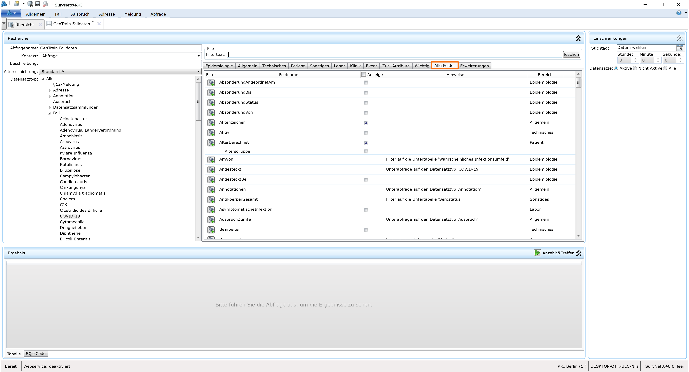

Geben Sie nun im Suchfeld „Meldedatum“ ein und setzen einen Haken in der Auswahlbox der entsprechenden Zeile.
Setzen Sie den Haken dabei bitte **nur** für „Meldedatum“ und **keinen** seiner Unterpunkte.

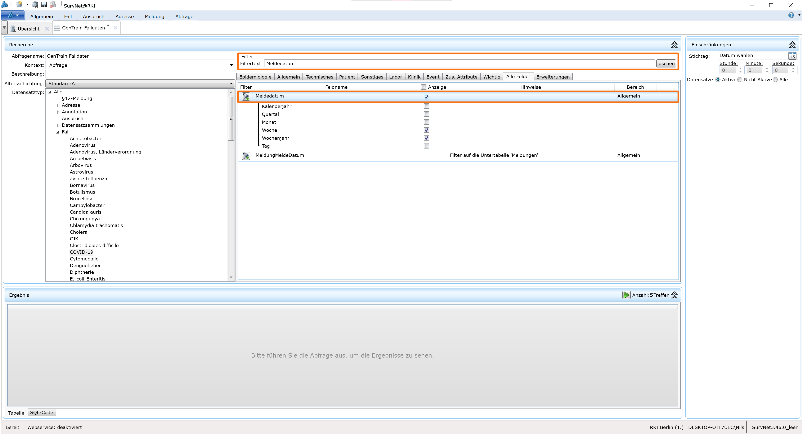

Suchen Sie als Nächstes nach dem „AngestecktBei“-Feld und setzen Sie dort ebenfalls einen Haken.

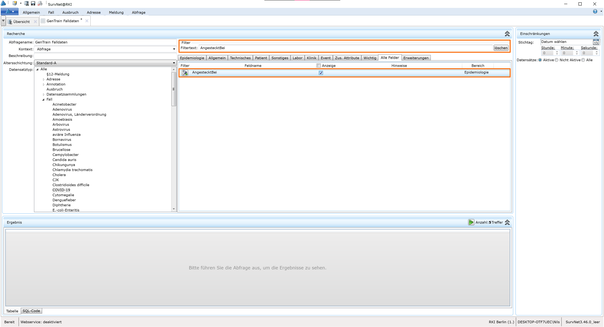

Zu guter Letzt benötigen Wir noch den Namen und die Adresse des mit dem Fall assoziierten Patienten,
sowie die Zuordnung des Falls zu einem Ausbruch.
Wechseln Sie dazu zunächst unterhalb des Suchfeldes von der Registerkarte „Alle Felder“
zu der direkt rechts davon, „Erweiterungen“.
Hier geben Sie nun im Suchfeld „Patient“ ein und schalten die „Patient/-in des Falles“-Erweiterung hinzu.
Geben Sie dann im Suchfeld „Ausbruchsinfo“ ein und schalten auch diese Erweiterung hinzu.

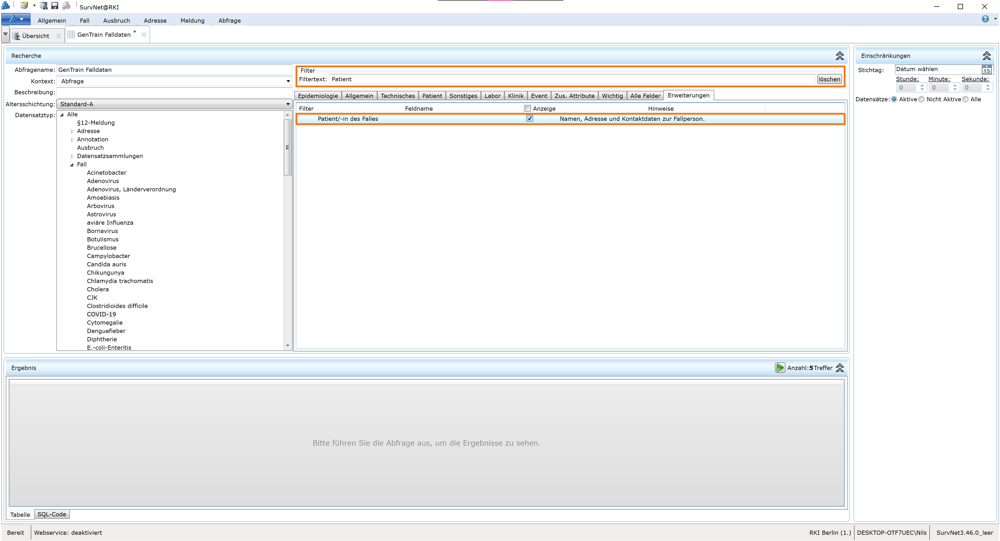

Die Falldaten-Abfrage ist damit vollständig.
Sie können nun, falls gewünscht, Filter auswählen, um Ihre Abfrage einzugrenzen.
Wie genau dies funktioniert, können Sie dem [SurvNet-Handbuch entnehmen](https://survnet.rki.de/Content/Service/Downloads.aspx).
Vor allem eine Eingrenzung des Meldezeitraums bietet sich an,
da Abfragen des gesamten Datenbestands eine lange Zeit in Anspruch nehmen können.
Um die Abfrage auszuführen, klicken Sie auf den kleinen grünen Startknopf, im Ergebnisbereich, weiter unten im Fenster.
Alternativ können Sie auch in der oberen Menüleiste auf „Abfrage“ klicken und dort den „Starten“-Knopf betätigen.

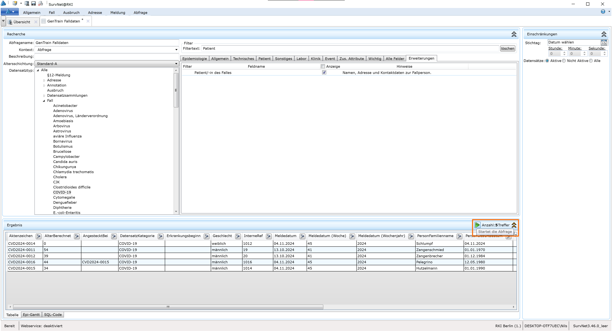

Achten Sie bitte darauf, dass die resultierende Tabelle in jedem Fall die unten stehenden Spalten beinhaltet.

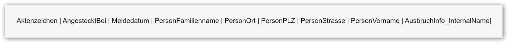

Sind Sie mit den Ergebnissen zufrieden und möchten keine weiteren Veränderungen vornehmen,
so können Sie nun die Abfrage mittels der Tastenkombination „STRG S“ oder über das Drop-Down-Menü speichern.
Für letztere Methode öffnen Sie wieder über den oben links befindlichen, blauen Knopf mit SurvNet Logo das Drop-Down-Menü
und klicken anschließend auf „Speichern“.

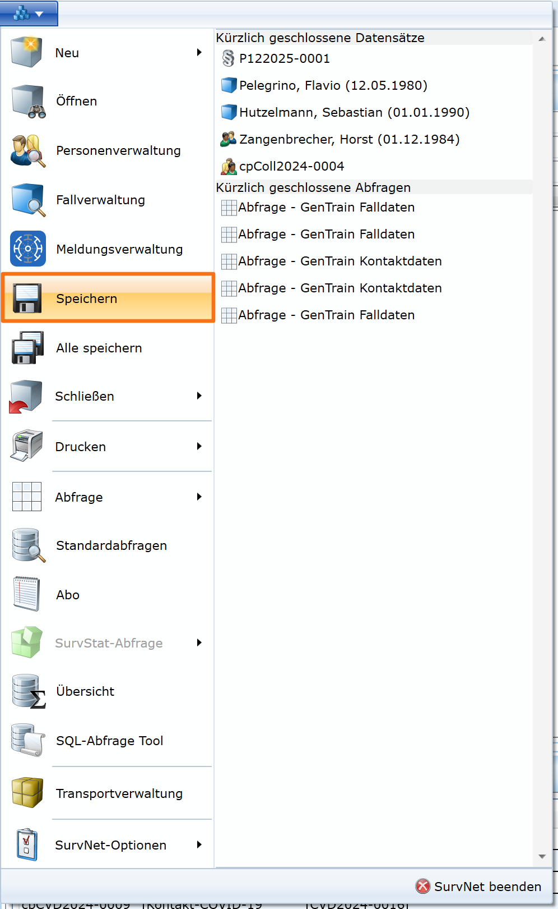

Dass der Speichervorgang erfolgreich abgeschlossen wurde erkennen Sie daran, dass das kleine Sternchen,
hinter dem Namen ihrer neuen Abfrage im Titel der Registerkarte, verschwunden ist.

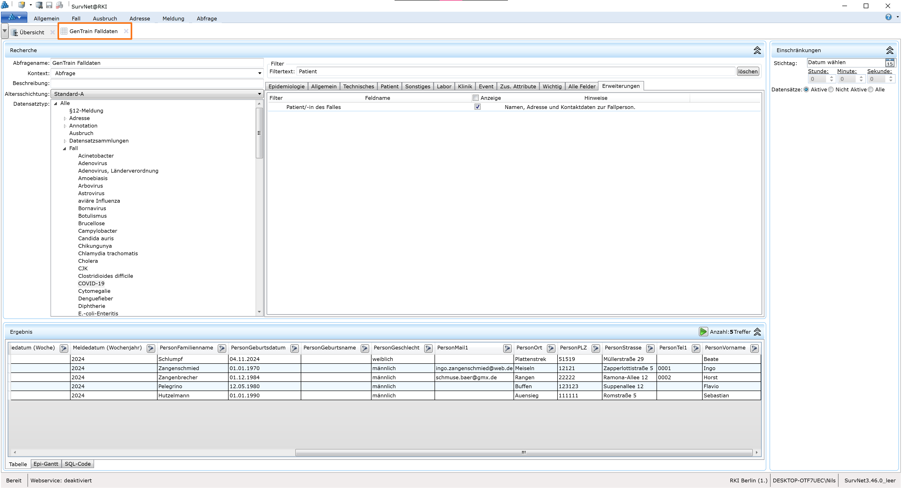

Um die Abfrageergebnisse zu exportieren klicken Sie erneut in der oberen Menüleiste auf „Abfrage“
und betätigen anschließend den „Exportieren“-Knopf.

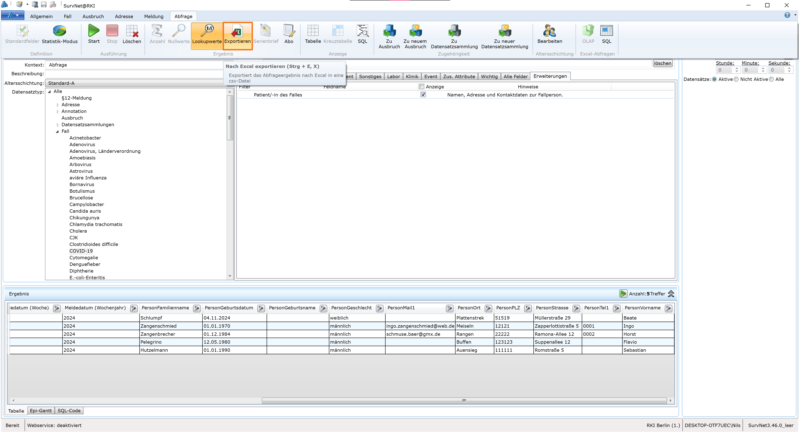

Wählen Sie nun einen Speicherort und tragen unter Dateiname bitte „Fälle“ ein.

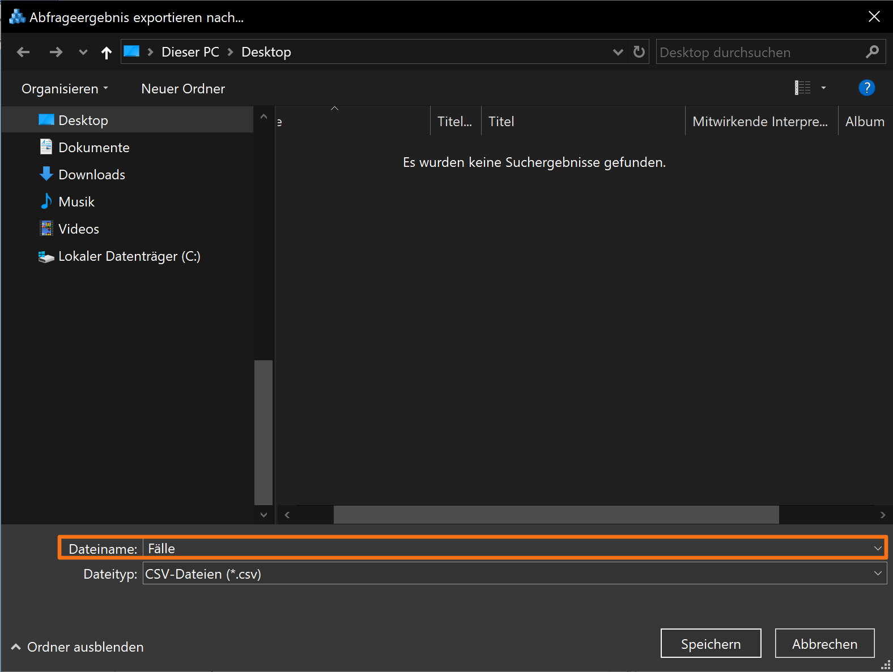

### Kontaktdaten-Abfrage

Für die Kontaktdaten-Abfrage verfahren Sie analog wie zur Falldaten-Abfrage.
Erstellen Sie zunächst eine neue Abfrage und geben ihr einen Namen, etwas „GenTrain Kontaktdaten“.
Wählen Sie anschließend unter „Datensatztyp“ die Kategorie „Kontakt-COVID-19“
bzw. einen anderen Kontakttyp, je nach gewünschtem Erreger aus.

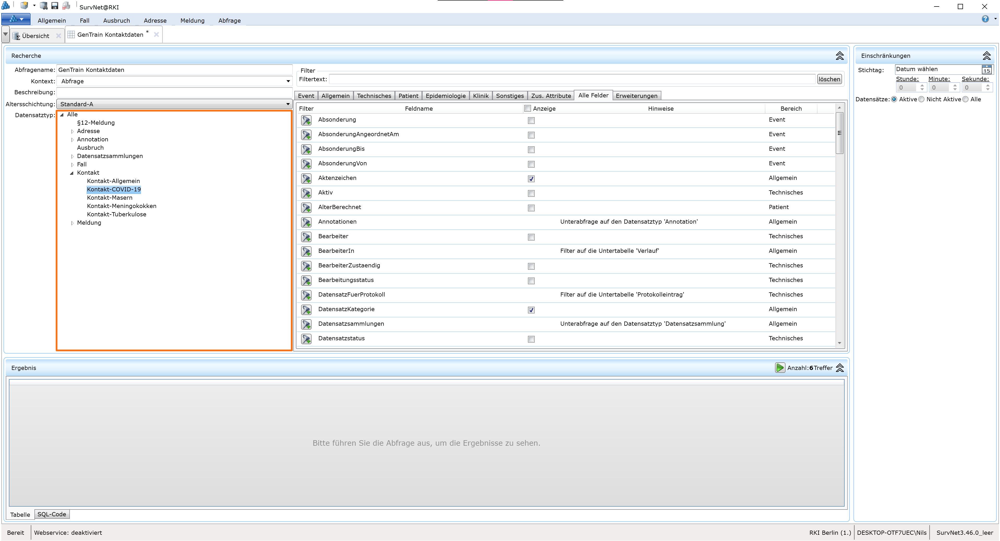

Auch hier müssen Wir weitere Felder hinzufügen.
Stellen Sie, wie oben erklärt, sicher, dass Sie sich unterhalb des Suchfeldes in der Registerkarte „Alle Felder“ befinden.
Geben Sie anschließend den Suchbefriff „Fall“ ein und fügen dieses Feld mit dem nebenstehenden Setzen eines Hakens hinzu.

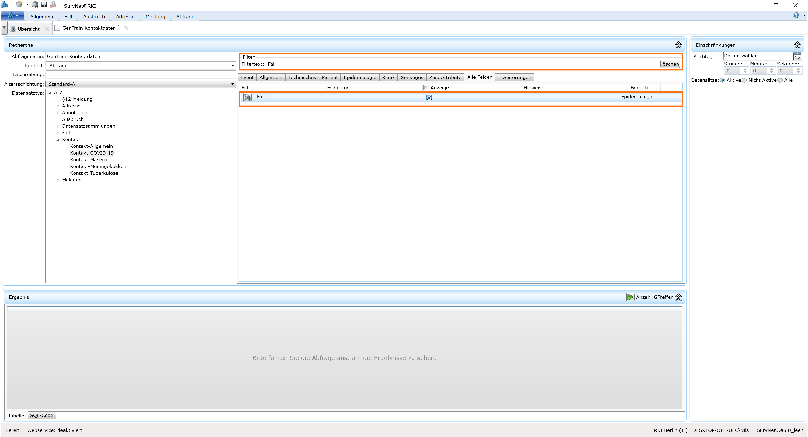

Wechseln Sie nun in die Registerkarte „Erweiterungen“, suchen nach der „Indexfall“-Erweiterung und fügen auch diese hinzu.

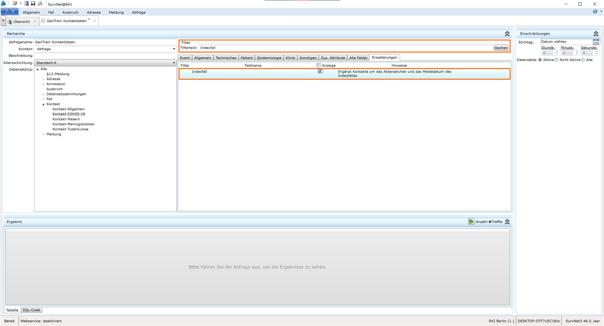

Anschließend können Sie, wie bereits bei der Falldaten-Abfrage, weiter Filter hinzufügen,
die Kontaktdaten-Abfrage speichern und ausführen.
Achten Sie auch hier bitte darauf, dass die resultierende Tabelle die hier aufgeführten Spalten beinhaltet:

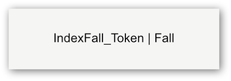

Exportieren Sie anschließend den Datensatz und tragen dabei unter Dateiname bitte „Kontakte“ ein.

## SurvNet Abfragen wiederfinden

Da Wir uns nicht bei jeder Nutzung von GenTrain die Mühe machen wollen,
die Abfragen erneut zu formulieren haben Wir diese unter einem beschreibenden Namen
(beispielsweise „GenTrain Falldaten“ und „GenTrain Kontaktdaten“) abgespeichert.
Um diese erneut nutzen zu können, öffnen Sie das Drop-Down-Menü oben links und fahren mit der Maus über das Feld „Abfrage“
und warten einen Moment, bis sich eine Liste mit weiteren Funktionen rechts des Feldes auftut -
oder klicken auf den kleinen schwarzen Pfeil direkt neben dem Feld.
Klicken Sie nun auf das „Öffnen“-Feld.

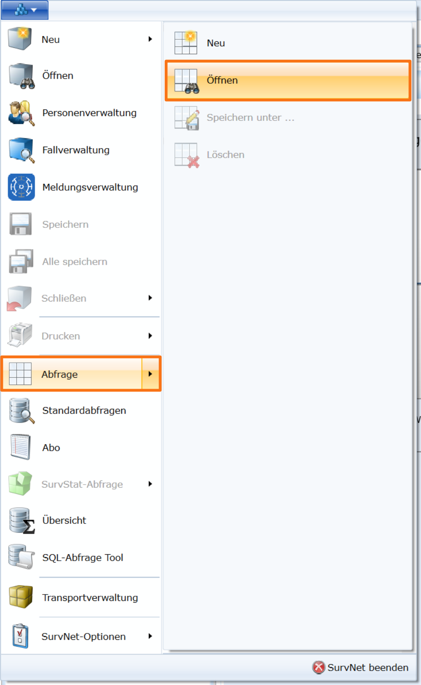

Im soeben geöffneten Fenster können Sie dann nach der gewünschten Abfrage suchen,
indem Sie deren Namen in das „Suchbegriff“-Feld eingeben und auf den „Suchen“-Knopf rechts daneben klicken.
Wählen Sie dann die gewünschte Abfrage aus der weiter unten befindlichen Liste aus
und klicken auf den „Ok“-Knopf unten rechts, worauf hin sich die gewünschte Abfrage öffnet.

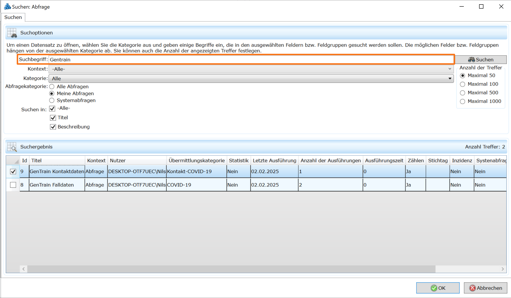

## Datenimport in GenTrain

Um die Daten in GenTrain zu importieren, navigieren Sie zur Seite „Datenverwaltung“.
Dort klicken Sie zunächst auf die Schaltfläche „Falldaten auswählen“
und wählen im sich öffnenden Windows-Explorer Fenster den Datensatz mit den Falldaten aus,
den Sie zuvor aus dem SurvNet exportiert haben.
Den Datensatz mit den Kontaktdaten können Sie, analog, über die rechte Schaltfläche „Kontaktdaten auswählen“ hochladen.
Die mittlere Schaltfläche „Sequenzdaten auswählen“ dient dem Hochladen von Sequenzdaten.

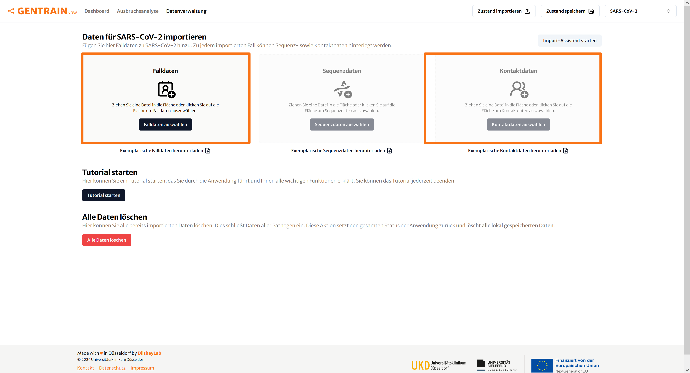