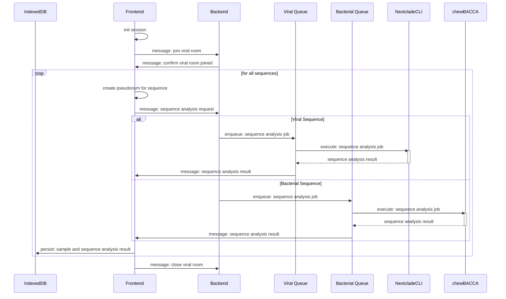
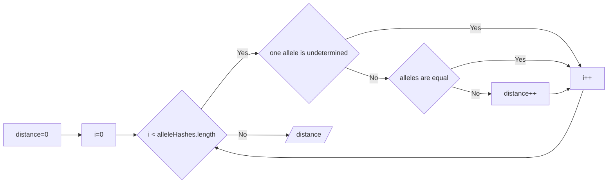

# Data Management

Outbreak analysis are based on _Minimum Spanning Tree (MST)_ visualizations of infection cases, which are connected by
genetic
distances or contact tracing events. These MSTs are reliant on an imported dataset consisting of cases, sequenced
samples and
contact information.

## File Imports

### Cases

Cases are registered infection reports from the health authorities.
These are recorded using the <a href="https://www.rki.de/DE/Content/Infekt/IfSG/Software/software_inhalt.html" target="_
blank">SurvNet software</a> developed by the RKI. To import case data from the SurvNet a CSV structure with relevant
fields was constructed:

| Field             | Naming options                        | Description                                                       | Required |
| ----------------- | ------------------------------------- | ----------------------------------------------------------------- | -------- |
| Case id           | `Fall ID, Aktenzeichen`               | Unique ID of the case                                             | ✅       |
| Registration date | `Registrierungsdatum, Meldedatum`     | Date of registration in SurvNets                                  | ✅       |
| Sequence id       | `Sequenz ID`                          | Fasta ID of the corresponding sequence                            |          |
| Outbreak          | `Ausbruch, AusbruchInfo_InternalName` | Suspected outbreak association                                    |          |
| Infected by       | `Angesteckt bei, AngestecktBei`       | Unique ID of a case that was given as the origin of the infection |          |
| Firstname         | `Vorname, PersonVorname`              | First name of the person associated with the case                 |          |
| Lastname          | `Nachname, PersonFamilienname`        | Last name of the person associated with the case                  |          |
| City              | `Ort, PersonOrt`                      | Place of residence of the person associated with the case         |          |
| Zip code          | `PLZ, PersonPLZ`                      | Zip code of the person associated with the case                   |          |
| Street            | `Straße, PersonStrasse`               | Street of the person associated with the case                     |          |
| Flexible category | `Kategorie:{category_name}`           | Flexible category for further differentiation                     |          |

### Samples (Sequences)

Samples provide mappings between cases and the corresponding sequenced genome. It is worth noting that not every case
has to be sequenced, as Gentrain can also provide valuable inferences based on contact tracing information. However, it
is the genetic information that makes gentrain what it is!

A fasta file containing the sequences identified by so-called fasta IDs is required to import samples.
Genetic distances are calculated between all samples, which are then assembled in a distance matrix. This distance
matrix enables
to create a minimum spanning tree for the cases based on the genetic distance. The procedure is slightly different for
viral and bacterial samples.


### Contact Person Processes

Contact person processes provide information about which cases were in contact with each other. This information extends the contact information we extract from addresses and names. The import of contact persons leads to contact edges that are labelled 'Contact person'.

| Field     | Naming options | Description                                                | Required |
| --------- | -------------- | ---------------------------------------------------------- | -------- |
| Case id 1 | `Fall ID 1`    | Unique ID of the first case of the contact person process  | ✅       |
| Case id 2 | `Fall ID 2`    | Unique ID of the second case of the contact person process | ✅       |

## Sequence Analysis

In order to calculate genetic distances between viral and bacterial genome we analyse genetic sequences against their
reference genome. This way we manage to persist a minified data structure without significant information loss. Since
viral sequences are generally available in their entirety and bacterial sequences are usually sequenced in assemblies,
different analysis techniques are applied.

### Viral Sequence Analysis

#### Mutation Calling

For viral sequences we determine mutations based on the corresponding reference genome, which is done using the
<a href="https://docs.nextstrain.org/projects/nextclade/en/stable/user/nextclade-cli/index.html" target="_blank">
Nextclade CLI</a>.
Nextclade provides mutation objects consisting of snps, insertions, deletions, Ns and nonACGTN-characters.
These mutation objects enable us to calculate genetic distances without persisting whole sequences.

#### Viral Results

NextClade provides a range of information about each analyzed sample. This information can be stored in different file formats, in our case we receive a JSON object. This object contains information about the recognised clade, quality measures of the sequences and mutation information.

Recognised substitutions, insertions, deletions, missings and nonACGTNs of the sequence are stored in the browser of the user. This information enables us to reconstruct sequences without obtaining the entire character string, taking into account the alignment of the sequences.

```json title="Example Viral Result"
{
    substitutions: [
        {pos: 209, refNuc: 'G', qryNuc: 'T'},
        {pos: 240, refNuc: 'C', qryNuc: 'T'},
        {pos: 3036, refNuc: 'C', qryNuc: 'T'},
        ...
        {pos: 29741, refNuc: 'G', qryNuc: 'T'}
    ],
    insertions: [
        {pos: 18099, qryNuc: 'TCG'},
        {pos: 29741, qryNuc: 'ACGT'}
    ],
    deletions: [
        {
            range: {begin: 28247, end: 28253}
        }
    ],
    missings: [
        {
            character: 'N',
            range: {begin: 0, end: 54}
        },
        {
            character: 'N',
            range: {begin: 6839, end: 6840}
        }
    ],
    nonACGTNs: [
        {
            character: 'Y',
            range: {begin: 4504, end: 4505}
        },
    ]
}
```

### Bacterial Sequence Analysis

#### Allele Calling

Bacterial sequences are analysed using chewBACCA. According to its own docs "chewBBACA is a software suite for the
creation and evaluation of core genome and whole genome MultiLocus Sequence Typing (cg/wgMLST) schemas and results". For
Gentrain, we use <a href="https://chewbbaca.readthedocs.io/en/latest/user/modules/AlleleCall.html" target="_blank">
chewBACCA's AlleleCall
service</a>
which provides mappings between each gene and the corresponding
allele in the sequences. Based on these mappings, we then calculate genetic distances by differentiating between the
allele sets of two sequences.

#### Results

Bacterial sequence analyses result in mappings between genes and allele sequences of the corresponding sample (Gene Id: Allele Sequence). In addition, these allele sequences are hashed to minify sequence length and ensure scheme independence.

```json title="Example Bacterial Result"
{
    SAUR0001: "d3627b0e335350fc61d130d50e6516b2",
    SAUR0002: "34d94e7230113031e160b5880f0ed5af",
    SAUR0003: "ddf68eaae82c14021c4f44f73ac0789f",
    ...
    SAUR3016: "e25053695fa8a872d478c73aba78c26a"
}
```

### UML Sequence Diagram



## Distance Calculation

This step aims to determine a distance between the individual samples of the imported data.

### Bacterial Distance Calculation

For bacterial samples, this process is quite trivial, as only the allele hashes per gene need to be compared. Different allele hashes lead to a distance increment of 1, while the distance value is not increased if the allele of one sample could not be determined by chewBACCA.



### Bacterial Distance Calculation

The viral distance for two results of the viral sequence analysis is calculated in two steps.

1. Sequences must be reconstructed. These reconstructions differ depending on the sequence with which the individual sequences are compared.
2. Reconstructed sequences are compared against each other and a distance is obtained.

## Distance Matrix

WIP
