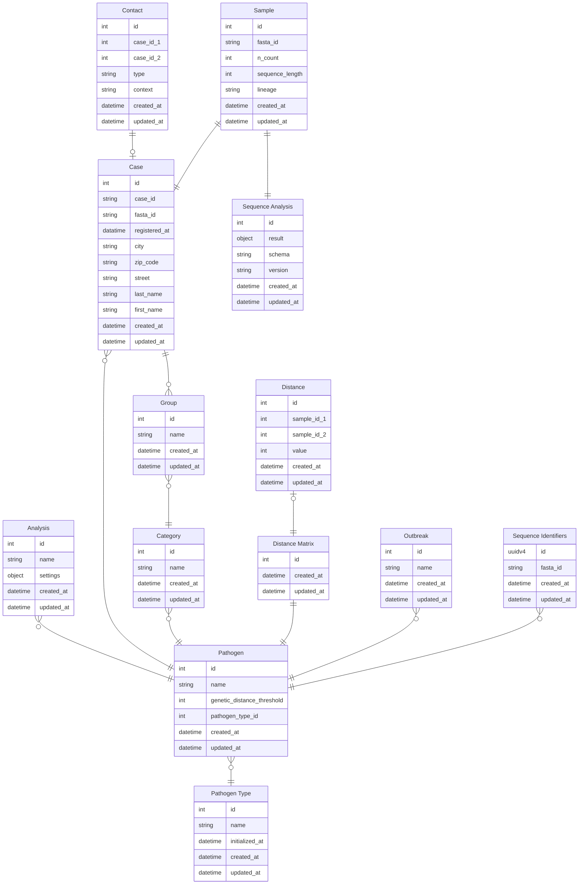
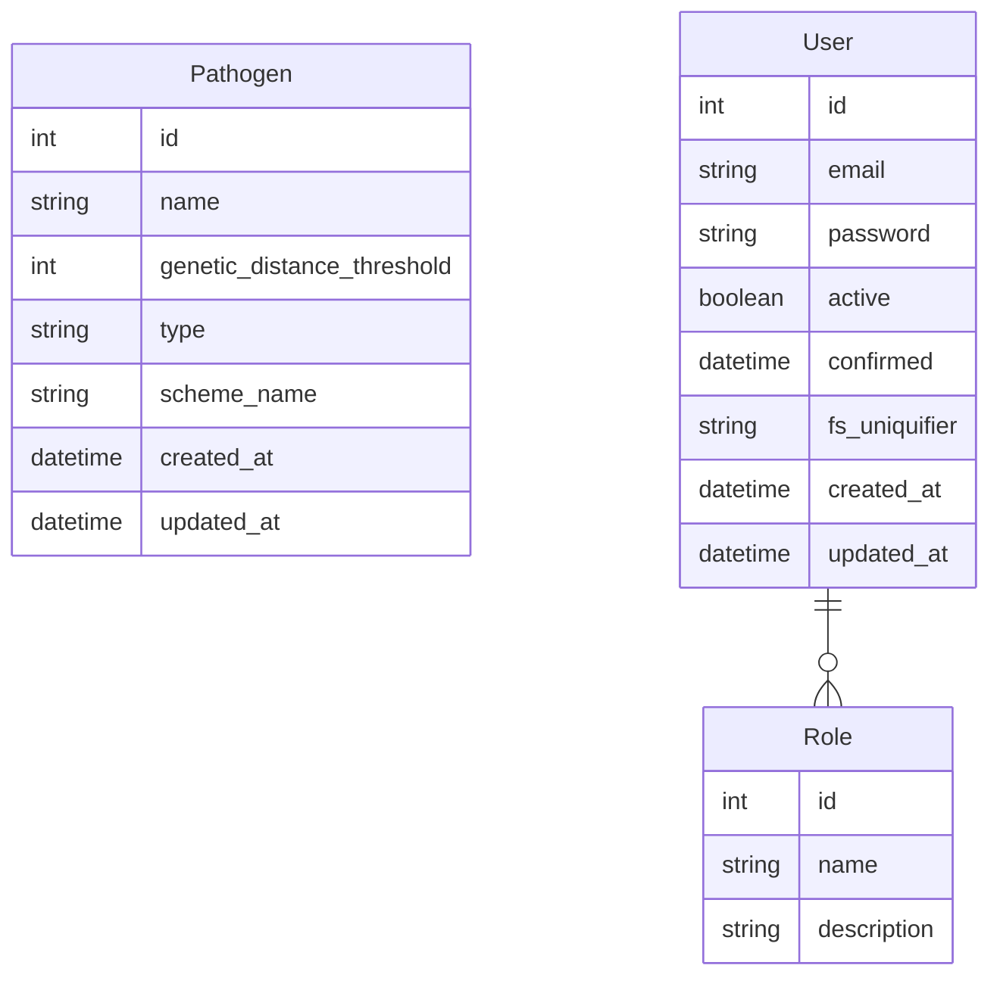

# Data Management

Outbreak analysis are based on _Minimum Spanning Tree (MST)_ visualizations of infection cases, which are connected by
genetic
distances or contact tracing events. These MSTs are reliant on an imported dataset consisting of cases, sequenced
samples and
contact information.

## File Imports

### Cases

Cases are registered infection reports from the health authorities.
These are recorded using the <a href="https://www.rki.de/DE/Content/Infekt/IfSG/Software/software_inhalt.html" target="_
blank">SurvNet software</a> developed by the RKI. Personal data is exclusively handled and persisted on the client side.

To import case data from the SurvNet a CSV structure with relevant
fields was constructed:

| Field             | Naming options                                                                                                                                                                                  | Description                                                       | Required |
| ----------------- | ----------------------------------------------------------------------------------------------------------------------------------------------------------------------------------------------- | ----------------------------------------------------------------- | -------- |
| Case id           | `Fall ID`, `Aktenzeichen`                                                                                                                                                                       | Unique ID of the case                                             | ✅       |
| Registration date | `Registrierungsdatum`, `Meldedatum`                                                                                                                                                             | Date of registration in SurvNets                                  | ✅       |
| Sequence id       | `Sequenz ID`                                                                                                                                                                                    | Fasta ID of the corresponding sequence                            |          |
| Outbreak          | `Ausbruch`, `AusbruchInfo_InternalName`, `AusbruchInfo_NameGA`, `AusbruchInfo_NameLS`, `AusbruchInfo_NameRKI`,`AusbruchInfo_GuidRecord`, `AusbruchInfo_Aktenzeichen`, `AusbruchInfo_InterneRef` | Suspected outbreak association                                    |          |
| Infected by       | `Angesteckt bei`, `AngestecktBei`                                                                                                                                                               | Unique ID of a case that was given as the origin of the infection |          |
| Firstname         | `Vorname`, `PersonVorname`                                                                                                                                                                      | First name of the person associated with the case                 |          |
| Lastname          | `Nachname`, `PersonFamilienname`                                                                                                                                                                | Last name of the person associated with the case                  |          |
| City              | `Ort`, `PersonOrt`                                                                                                                                                                              | Place of residence of the person associated with the case         |          |
| Zip code          | `PLZ`, `PersonPLZ`                                                                                                                                                                              | Zip code of the person associated with the case                   |          |
| Street            | `Straße`, `PersonStrasse`                                                                                                                                                                       | Street of the person associated with the case                     |          |
| Flexible category | `Kategorie:{category_name}`                                                                                                                                                                     | Flexible category for further differentiation                     |          |

### Samples (Sequences)

Samples provide mappings between cases and the corresponding sequenced genome. It is worth noting that not every case
has to be sequenced, as Gentrain can also provide valuable inferences based on contact tracing information. However, it
is the genetic information that makes gentrain what it is!

Whenever communicating with the server fasta ids are pseudomized using UUIDv4 values ([RFC9562](https://www.rfc-editor.org/rfc/rfc9562.html#name-example-of-a-uuidv4-value){:target="\_blank"}).

#### Fasta File Format

##### Viral Fasta Format

A fasta file containing the sequences identified by so-called fasta ids is required to import samples. Each fasta file contains several sequences that can be imported simultaneously. The upload of multiple files is not supported for virus samples.

```title="sequences.fasta"
    >{fasta_id_1}
    {sequence_1}
    >{fasta_id_2}
    {sequence_2}
    ...
    >{fasta_id_n}
    {sequence_n}

```

##### Bacterial Fasta Format

Bacterial genomes are provided in the form of assemblies since they consist of a genome sequence as well as a plasmid sequence. In addition, it is not a trivial task to assemble coherent bacterial sequences, which results in several contigs that combine to form the entire sequence. Each contig is characterised by an individual header whose information is not of interest for our use case. For bacterial samples, the fasta id must be represented by the name of the fasta file. The upload of multiple files is supported for bacterial samples.

```title="{fasta_id}.fasta"
    >{assembly_contig_header_1}
    {assembly_contig_sequence_1}
    >{assembly_contig_header_2}
    {assembly_contig_sequence_2}
    ...
    >{assembly_contig_header_n}
    {assembly_contig_sequence_n}

```

#### Sequence Processing

Genetic distances are calculated between all samples, which are then assembled in a distance matrix. This distance
matrix enables
to create a minimum spanning tree for the cases based on the genetic distance. The procedure is slightly different for
viral and bacterial samples.


### Contact Person Processes

Contact person processes provide information about which cases were in contact with each other. This information extends the contact information we extract from addresses and names. The import of contact persons leads to contact edges that are labelled 'Contact person'.

| Field     | Naming options | Description                                                | Required |
| --------- | -------------- | ---------------------------------------------------------- | -------- |
| Case id 1 | `Fall ID 1`    | Unique ID of the first case of the contact person process  | ✅       |
| Case id 2 | `Fall ID 2`    | Unique ID of the second case of the contact person process | ✅       |

## Entity Relationship Models

### Client Side (IndexedDB)



### Server Side (ProstgreSQL)


