# Genomic Operations

## Sequence Analysis

In order to calculate genetic distances between viral and bacterial genome we analyse genetic sequences against their
reference genome. This way we manage to persist a minified data structure without significant information loss. Since
viral sequences are generally available in their entirety and bacterial sequences are usually processed into assemblies,
different analysis techniques are applied.

### Viral Sequence Analysis

#### Mutation Calling

For viral sequences we determine mutations based on the corresponding reference genome, which is done using the<a href="https://docs.nextstrain.org/projects/nextclade/en/stable/user/nextclade-cli/index.html" target="_blank">Nextclade CLI</a>.
Nextclade provides mutation objects consisting of snps, insertions, deletions, Ns and nonACGTN-characters.
These mutation objects enable us to calculate genetic distances without persisting whole sequences. All sequences of a fasta file are analyzed simultaneously in a single job. The fasta content is pseudonymized before sending it to the sever, by replacing fasta ids with corresponding random pseudonyms.

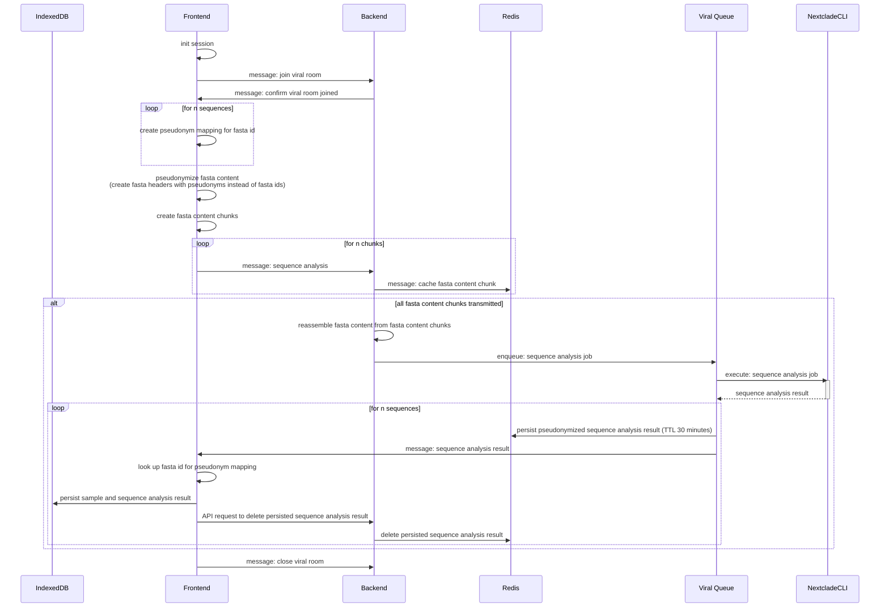

#### Viral Results

Nextclade provides a range of information about each analyzed sample. This information can be stored in different file formats, in our case we receive a JSON object. This object contains information about the recognised clade, quality measures of the sequences and mutation information.

Recognised substitutions, insertions, deletions, missings and nonACGTNs of the sequence are stored in the browser of the user. This information enables us to reconstruct sequences without obtaining the entire character string, taking into account the alignment of the sequences.

```json title="Example Viral Result"
{
    substitutions: [
        {pos: 209, refNuc: 'G', qryNuc: 'T'},
        {pos: 240, refNuc: 'C', qryNuc: 'T'},
        {pos: 3036, refNuc: 'C', qryNuc: 'T'},
        ...
        {pos: 29741, refNuc: 'G', qryNuc: 'T'}
    ],
    insertions: [
        {pos: 18099, qryNuc: 'TCG'},
        {pos: 29741, qryNuc: 'ACGT'}
    ],
    deletions: [
        {
            range: {begin: 28247, end: 28253}
        }
    ],
    missings: [
        {
            character: 'N',
            range: {begin: 0, end: 54}
        },
        {
            character: 'N',
            range: {begin: 6839, end: 6840}
        }
    ],
    nonACGTNs: [
        {
            character: 'Y',
            range: {begin: 4504, end: 4505}
        },
    ]
}
```

### Bacterial Sequence Analysis

#### Allele Calling

Bacterial sequences are analysed using chewBACCA. According to its own docs "chewBBACA is a software suite for the
creation and evaluation of core genome and whole genome MultiLocus Sequence Typing (cg/wgMLST) schemas and results". For
Gentrain, we use <a href="https://chewbbaca.readthedocs.io/en/latest/user/modules/AlleleCall.html" target="_blank">
chewBACCA's AlleleCall
service</a>
which provides mappings between each reference gene and the corresponding
allele in the sequences. Based on these mappings, we then calculate genetic distances by differentiating between the
allele sets of two sequences.

Each bacterial sequence assembly is provided in a seperate fasta file. Therefore the bacterial sequence import allows the simultaneous upload of multiple files. File names must correspond to fasta ids that are linked to the uploaded case data. These fasta ids are pseudonymized before ever communicating with the server and exclusively persisted on the client side.

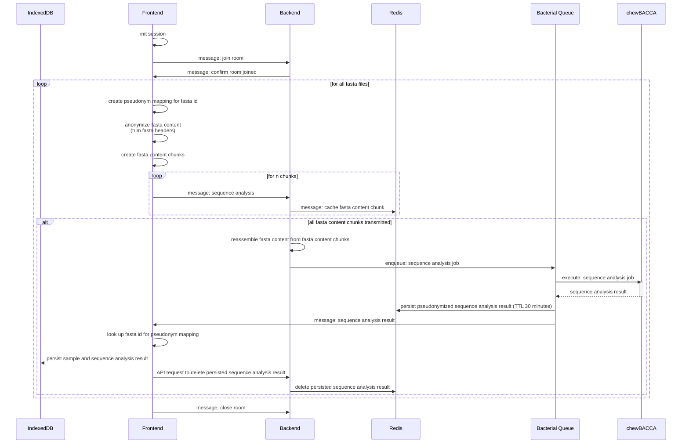

#### Results

Bacterial sequence analyses result in mappings between reference genes and allele sequences of the corresponding sample (Gene Id: Allele Sequence). In addition, these allele sequences are hashed to minify sequence length and ensure scheme independence.

```json title="Example Bacterial Result"
{
    SAUR0001: "d3627b0e335350fc61d130d50e6516b2",
    SAUR0002: "34d94e7230113031e160b5880f0ed5af",
    SAUR0003: "ddf68eaae82c14021c4f44f73ac0789f",
    ...
    SAUR3016: "e25053695fa8a872d478c73aba78c26a"
}
```

## Distance Calculation

This step aims to determine a distance between the individual samples of the imported data.

### Bacterial Distance Calculation

For bacterial samples, this process is quite trivial, as only the allele hashes per gene need to be compared. Different allele hashes lead to a distance increment of 1, while the distance value is not increased if the allele of one sample could not be determined by chewBACCA.

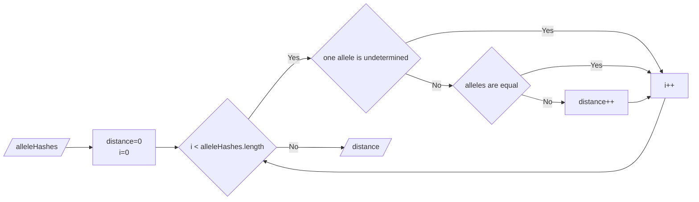

### Viral Distance Calculation

The viral distance for two results of the viral sequence analysis is calculated in three steps.

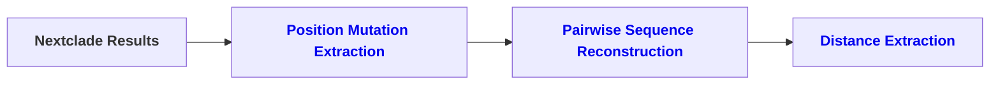

#### Position Mutation Extraction

This process aims to translate the Nextclade result format into a mapping of reference sequence positions and occurring mutations, which is the input for pairwise sequence reconstruction.

```json title="Example Position Mutation Mapping"
{
    "0": {"snp": "N"},
    "1": {"snp": "N"},
    "2": {"snp": "N"},
    ...
    "2030": {"snp": "A"},
    ...
    "10030": {"del": "-"},
    "10031": {"del": "-"},
    "10032": {"del": "-"},
    "10033": {"del": "-"},
    ...
    "22045": {"ins": "ACGGT"},
    ...
    "29780": {"snp": "N"},
    "29781": {"snp": "N"},
    "29782": {"snp": "N"}
}
```

#### Pairwise Sequence Reconstruction

Sequences must be reconstructed using the Nextclade results. The sequences are reconstructed in pairs to take into account the alignment of the individual sequences. The reference sequence is iterated nucleotide by nucleotide, and mutations affect the resulting sequences at each iteration. The reconstructions differ depending on the sequence to which the individual sequences are compared, as insertions can influence the overall length of a sequence.

<div class="flex-charts">
<div>
<div class="title">alignSamples</div>
<div class="description">Returns two sequences of the same length, taking into account all mutations of the original sequences. This output enables the calculation of a distance between both sequences.</div>
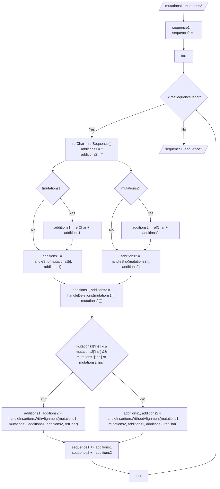
</div>
<div>
<div class="title">handleSnp</div>
<div class="description">Substitutions can simply be added to one sequence without affecting the other sequence.</div>
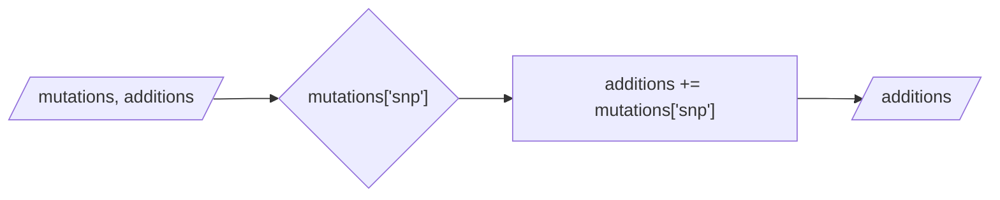
<div class="title">handleDeletions</div>
<div class="description">For each deletion a gap ('-') is added to the specific sequence, in case the other sequence has no deletion at this position. If both sequences contain deletion for a position we don't need to add any additions to the sequences.</div>
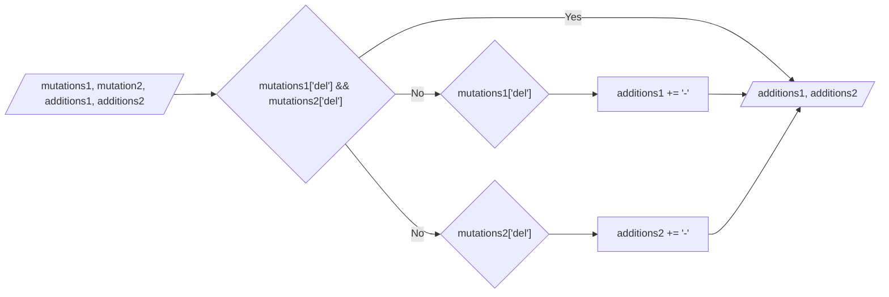

<div class="title">handleInsertionsWithAlignment</div>
<div class="description">If both sequences contain different insertions, we must align both insertion strings so that both sequences remain the same length. This alignment is performed on the server side (gentrainApi.alignSequences).</div>
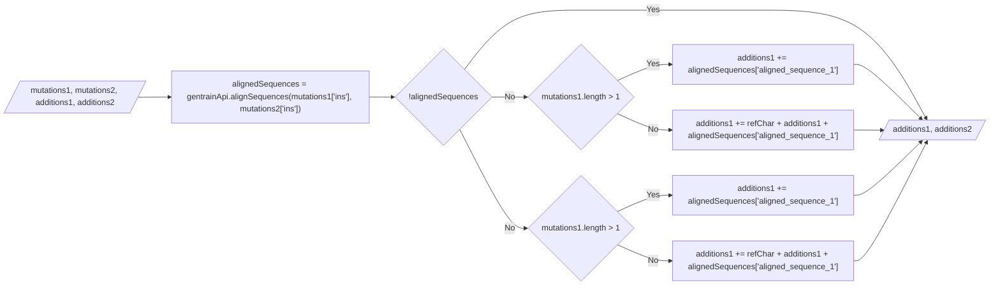

<div class="title">handleInsertionsWithoutAlignment</div>
<div class="description">If both sequences contain equal insertions, we add the inserted string to both sequences. If only one sequence contains an insertion, the inserted string is inserted into this sequence and gaps ('-') are inserted into the other sequence in parallel.</div>
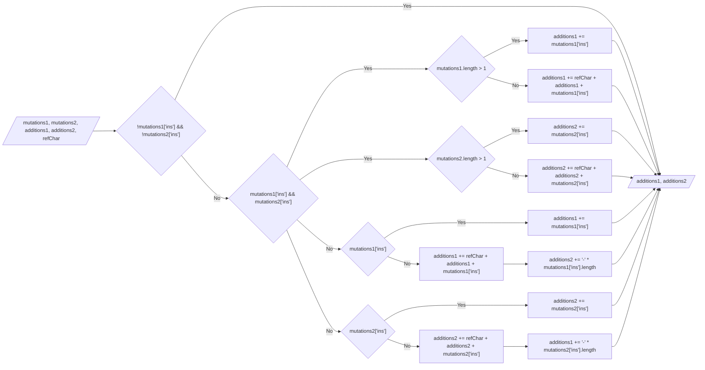

</div>
</div>
#### Distance Extraction

Reconstructed sequences are compared against each other and a distance is obtained.

<div class="flex-charts">
<div>
<div class="title">calculateDistance</div>
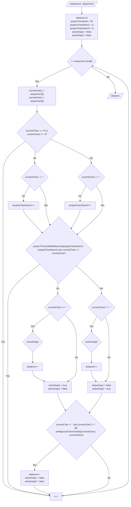
</div>
<div>
<div class="title">properThresholdNotReached</div>
<div class="description">The distance is only increased if an appropriate number of nucleotide characters have been read in to ensure that the distances are obtained from the qualitative sequence of the nucleotides.</div>
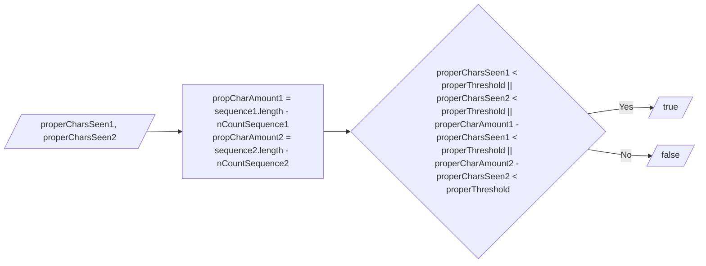
<div class="title">ambiguousCharsOverlap</div>
<div class="description">We do not want to increase the distance if the currently focussed different characters are part of the possible options for an ambiguous nucleotide in the other sequence.</div>
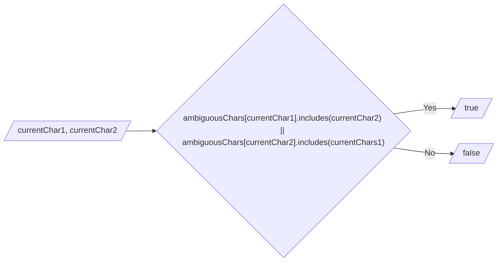
<div class="description">
```js title="ambiguousChars"
{
  "A": ["A"],
  "C": ["C"],
  "G": ["G"],
  "T": ["T"],
  "U": ["U"],
  "M": ["A", "C"],
  "R": ["A", "G"],
  "S": ["C", "G"],
  "W": ["A", "T"],
  "Y": ["C", "T"],
  "K": ["G", "T"],
  "V": ["A", "C", "G"],
  "H": ["A", "C", "T"],
  "D": ["A", "G", "T"],
  "B": ["C", "G", "T"],
  "N": ["A", "C", "G", "T"],
  "X": ["A", "C", "G", "T"]
}
```
</div>
</div>
</div>

## Distance Matrix Assembling

<div class="title">calculateSampleDistances</div>
<div class="description">Firstly, the distance between all samples in the dataset is calculated and persisted in the IndexedDB. By calculating the distance between two samples only once, we minimize the calculation time. The complete distance matrix will be assembeled in the subsequent step.</div>

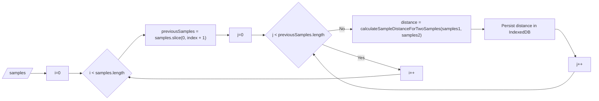

|        | s1  | s2             | s3             | s4             |
| ------ | --- | -------------- | -------------- | -------------- |
| **s1** | -   | d<sub>21</sub> | d<sub>31</sub> | d<sub>41</sub> |
| **s2** | -   | -              | d<sub>32</sub> | d<sub>42</sub> |
| **s3** | -   | -              | -              | d<sub>43</sub> |
| **s4** | -   | -              | -              | -              |

<div class="title">assembleDistanceMatrix</div>
<div class="description">A complete distance matrix (NxN) is assembeled using the previously persisted distances. This distance matrix is then used to visualize minimum spanning tress for outbreak analyses.</div>

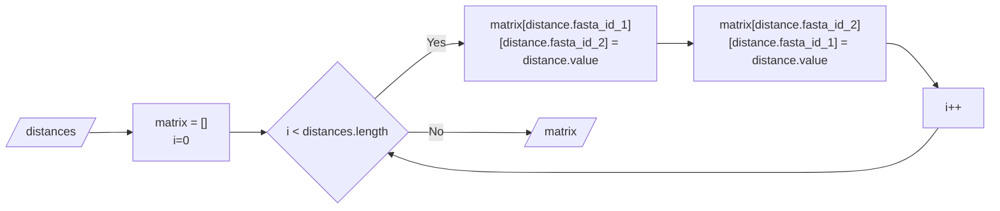

|        | s1             | s2             | s3             | s4             |
| ------ | -------------- | -------------- | -------------- | -------------- |
| **s1** | -              | d<sub>21</sub> | d<sub>31</sub> | d<sub>41</sub> |
| **s2** | d<sub>21</sub> | -              | d<sub>32</sub> | d<sub>42</sub> |
| **s3** | d<sub>23</sub> | d<sub>21</sub> | -              | d<sub>43</sub> |
| **s4** | d<sub>24</sub> | d<sub>24</sub> | d<sub>34</sub> | -              |
