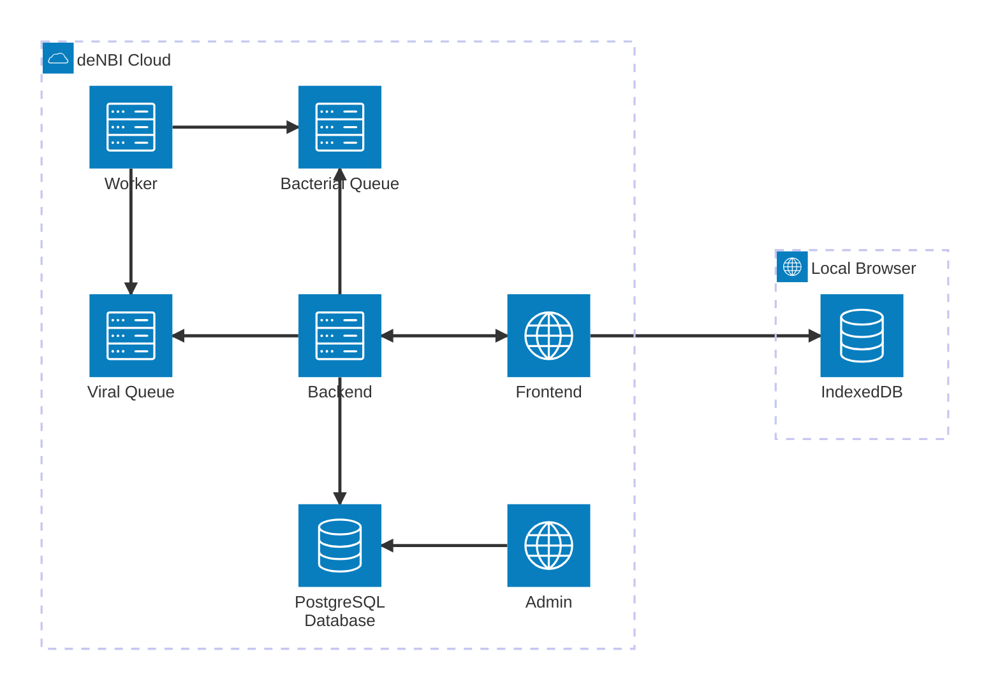

# Project Architecture

## Overview

**Gentrain** is a browser-based web application. Below are the key components of its architecture.

| Component               | Description                                                                                                                                                       |
|-------------------------|-------------------------------------------------------------------------------------------------------------------------------------------------------------------|
| **Frontend**            | The majority of the business logic resides on the frontend, with most data persisted in the user’s browser using IndexedDB.                                   |
| **IndexedDB**           | A low-level API for client-side storage that provides powerful and efficient database functionalities.                                                            |
| **Backend**             | A Flask server supports the application by offering: <ul><li>An API for backend communication.</li><li>A WebSocket server for real-time updates.</li> |
| **Admin**               | An User interface for managing pathogen data and especially schemes.                                                                                              |
| **Worker**              | Long-running tasks, such as sequence analyses, are managed through a queue-based system handled by a Worker.                                                  |
| **PostgreSQL Database** | Pathogen-related data is stored in a server-side postgres database, which is accessible and manageable via the Admin Panel.                                   |

## Database

## Containerization

The project architecture is technically implemented in the following Docker containers.

| Container         | Description                                                                                       | Locally accessible via |
|-------------------|---------------------------------------------------------------------------------------------------|------------------------|
| **Caddy**         | Reverse proxy and web server                                                                      | -                      |
| **Redis**         | In-memory data structure store                                                                    | -                      |
| **Backend**       | Python-based backend service providing API, WebSocket Server and Admin Panel                      | http://localhost:4000  |
| **Worker**        | Background task processor                                                                         | -                      |
| **Frontend**      | Node.js-based frontend service to build the react application for production and test instances.s | -                      |
| **Redis Insight** | GUI for Redis monitoring and management                                                           | http://localhost:5540  |
| **Database**      | Server-side postgres database                                                                     | -                      |
| **PG Admin**      | Postgres database client                                                                          | http://localhost:7777  |

## Domain Driven Design

Frontend and backend project are structured in a domain (module) driven manner.