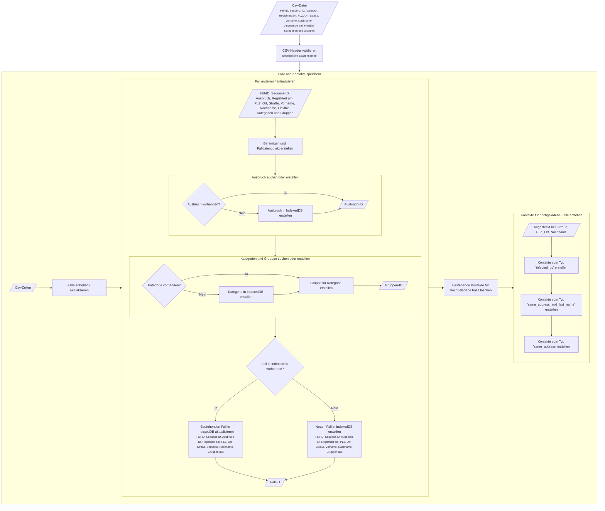
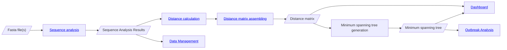
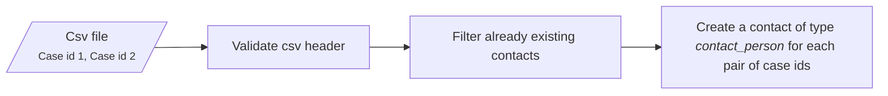
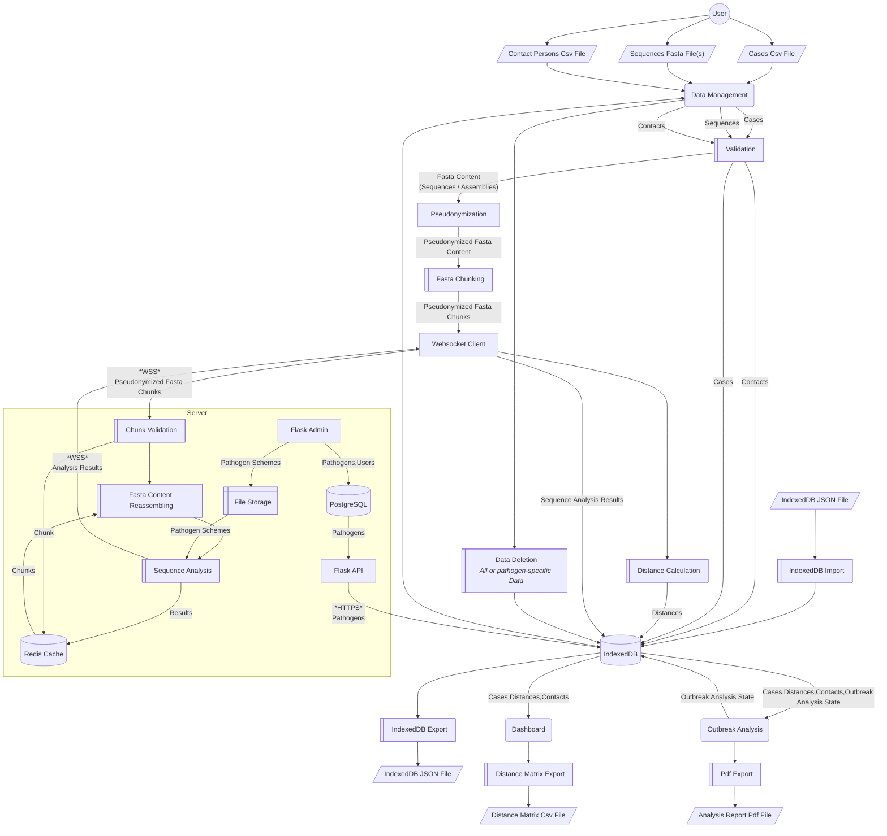
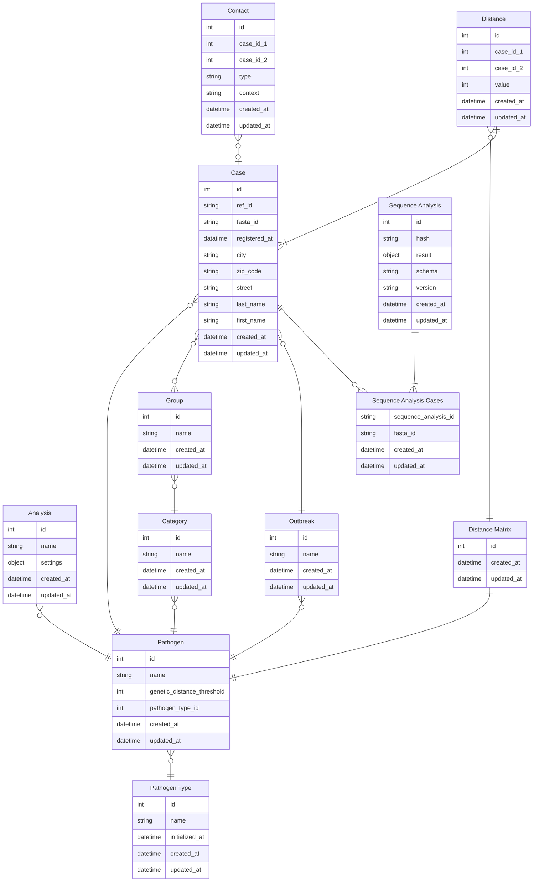
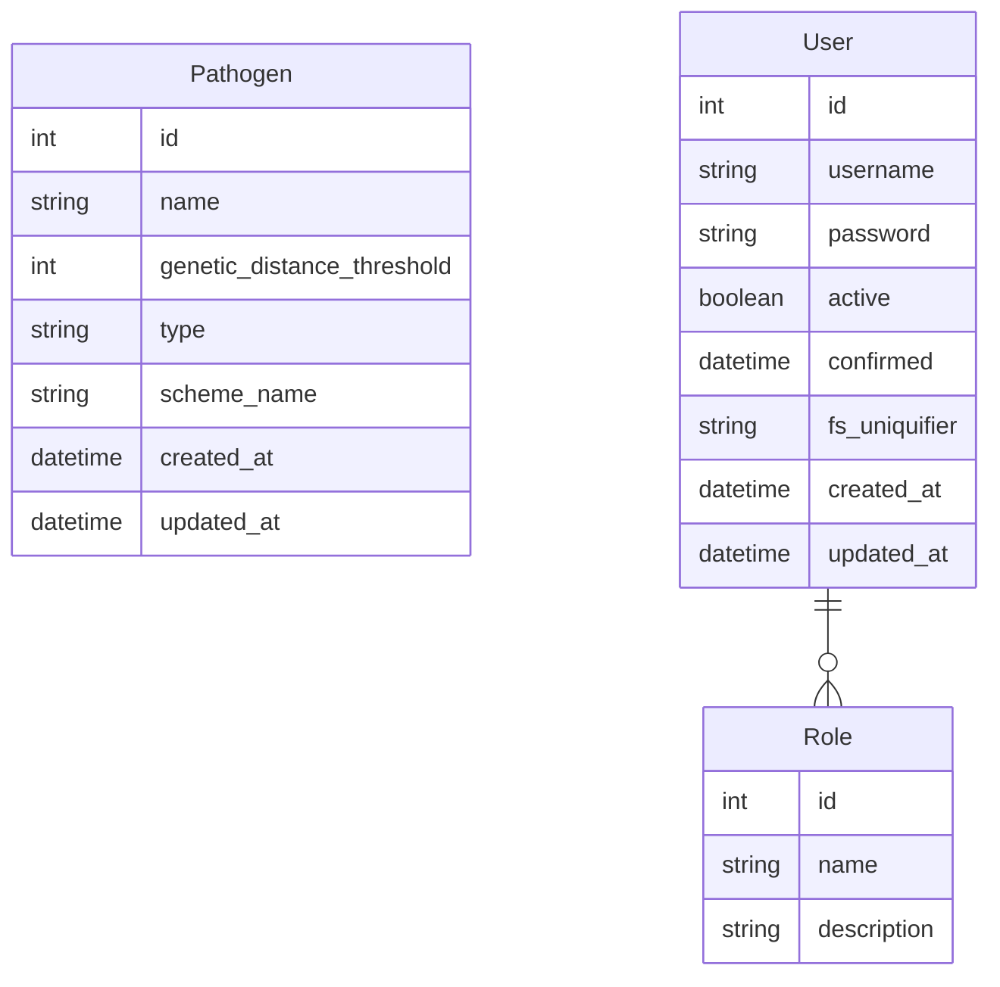

# Datenmanagement

Ausbruchsanalysen basieren auf _Minimum Spanning Tree (MST)_-Visualisierungen von Infektionsfällen, die durch genetische
Distanzen oder Kontaktverfolgungsereignisse verbunden sind. Diese MSTs sind auf einen importierten Datensatz angewiesen, der aus Fällen, sequenzierten
Proben und
Kontaktinformationen besteht.

## Datei-Importe

### Fälle

Fälle sind registrierte Infektionsmeldungen von den Gesundheitsbehörden.
Diese werden mit der vom RKI entwickelten <a href="https://www.rki.de/DE/Content/Infekt/IfSG/Software/software_inhalt.html" target="_
blank">SurvNet-Software</a> erfasst. Personenbezogene Daten werden ausschließlich clientseitig gehandhabt und gespeichert. Adressen und Namen werden verwendet, um Kontaktkanten zwischen Fällen zu erstellen, da es eine wertvolle Information ist, wenn Fälle an derselben Adresse leben (Wohngemeinschaften, Seniorenheime, ...) oder denselben Nachnamen haben (potenzielle Familienmitglieder).

Für den Import von Falldaten aus SurvNet wurde eine CSV-Struktur mit relevanten
Feldern erstellt:

| Field             | Naming options                                                                                                                                                                                  | Description                                                       | Required |
| ----------------- | ----------------------------------------------------------------------------------------------------------------------------------------------------------------------------------------------- | ----------------------------------------------------------------- | -------- |
| Case id           | `Fall ID`, `Aktenzeichen`                                                                                                                                                                       | Unique ID of the case                                             | ✅       |
| Registration date | `Registrierungsdatum`, `Meldedatum`                                                                                                                                                             | Date of registration in SurvNets                                  | ✅       |
| Sequence id       | `Sequenz ID`                                                                                                                                                                                    | Fasta ID of the corresponding sequence                            |          |
| Outbreak          | `Ausbruch`, `AusbruchInfo_InternalName`, `AusbruchInfo_NameGA`, `AusbruchInfo_NameLS`, `AusbruchInfo_NameRKI`,`AusbruchInfo_GuidRecord`, `AusbruchInfo_Aktenzeichen`, `AusbruchInfo_InterneRef` | Suspected outbreak association                                    |          |
| Infected by       | `Angesteckt bei`, `AngestecktBei`                                                                                                                                                               | Unique ID of a case that was given as the origin of the infection |          |
| Firstname         | `Vorname`, `PersonVorname`                                                                                                                                                                      | First name of the person associated with the case                 |          |
| Lastname          | `Nachname`, `PersonFamilienname`                                                                                                                                                                | Last name of the person associated with the case                  |          |
| City              | `Ort`, `PersonOrt`                                                                                                                                                                              | Place of residence of the person associated with the case         |          |
| Zip code          | `PLZ`, `PersonPLZ`                                                                                                                                                                              | Zip code of the person associated with the case                   |          |
| Street            | `Straße`, `PersonStrasse`                                                                                                                                                                       | Street of the person associated with the case                     |          |
| Flexible category | `Kategorie:{category_name}`                                                                                                                                                                     | Flexible category for further differentiation                     |          |

#### Fall-Persistenz und Kontaktextraktion



### Samples (Sequenzen)

Samples stellen Verknüpfungen (Mappings) zwischen Fällen und dem entsprechenden sequenzierten Genom bereit. Es ist erwähnenswert, dass nicht jeder Fall sequenziert werden muss, da Gentrain auch wertvolle Rückschlüsse auf der Grundlage von Kontaktverfolgungsinformationen liefern kann. Es sind jedoch die genetischen Informationen, die Gentrain zu dem machen, was es ist!

Bei der Kommunikation mit dem Server werden Fasta-IDs mithilfe von UUIDv4-Werten pseudonymisiert (<a href="https://www.rfc-editor.org/rfc/rfc9562.html#name-example-of-a-uuidv4-value" target="_blank">RFC9562</a>).

#### Fasta-Dateiformat

##### Virales Fasta-Format

Für den Import von Samples ist eine Fasta-Datei erforderlich, die die Sequenzen enthält, welche durch sogenannte Fasta-IDs identifiziert werden. Jede Fasta-Datei enthält mehrere Sequenzen, die gleichzeitig importiert werden können. Der Upload mehrerer Dateien wird für Virus-Samples nicht unterstützt.

```title="sequences.fasta"
    >{fasta_id_1}
    {sequence_1}
    >{fasta_id_2}
    {sequence_2}
    ...
    >{fasta_id_n}
    {sequence_n}

```

##### Bakterielles Fasta-Format

Bakterielle Genome werden in Form von Assemblies bereitgestellt, da sie sowohl aus einer Genomsequenz als auch aus einer Plasmidsequenz bestehen. Darüber hinaus ist es keine triviale Aufgabe, kohärente bakterielle Sequenzen zusammenzusetzen (Assemblierung), was zu mehreren Contigs führt, die sich zur Gesamtsequenz verbinden. Jedes Contig ist durch einen individuellen Header gekennzeichnet, dessen Informationen für unseren Anwendungsfall nicht von Interesse sind. Bei bakteriellen Samples muss die Fasta-ID durch den Namen der Fasta-Datei repräsentiert werden. Der Upload mehrerer Dateien wird für bakterielle Samples unterstützt.

```title="{fasta_id}.fasta"
    >{assembly_contig_header_1}
    {assembly_contig_sequence_1}
    >{assembly_contig_header_2}
    {assembly_contig_sequence_2}
    ...
    >{assembly_contig_header_n}
    {assembly_contig_sequence_n}

```

#### Sequenzverarbeitung

Zwischen allen Samples werden genetische Distanzen berechnet, die anschließend in einer Distanzmatrix zusammengefasst werden. Diese Distanzmatrix ermöglicht es, einen Minimum Spanning Tree für die Fälle auf Basis der genetischen Distanz zu erstellen. Das Verfahren ist bei viralen und bakteriellen Samples leicht unterschiedlich.



### Kontaktpersonen-Vorgänge

Kontaktpersonen-Vorgänge liefern Informationen darüber, welche Fälle miteinander in Kontakt standen. Diese Informationen erweitern die Kontaktinformationen, die wir aus Adressen und Namen extrahieren. Der Import von Kontaktpersonen führt zu Kontaktkanten, die als 'Contact person' bezeichnet werden.

| Field     | Naming options | Description                                                 | Required |
| --------- | -------------- | ----------------------------------------------------------- | -------- |
| Fall-ID 1 | `Fall ID 1`    | Eindeutige ID des ersten Falls des Kontaktpersonen-Vorgangs | ✅       |
| Fall-ID 2 | `Fall ID 2`    | Unique ID of the second case of the contact person process  | ✅       |



## Data Processing



## Entity Relationship Models

### Client Side (IndexedDB)



### Server Side (ProstgreSQL)


