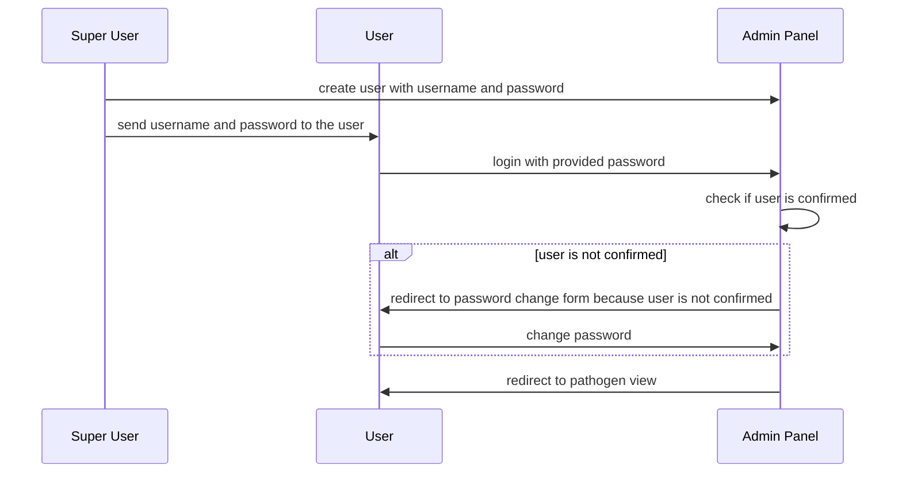

# Security and Data Privacy

## Processed Data

Gentrain only processes personal data on the client side.
Personal data is added via case imports and stored in the browser's IndexedDB.

Genetic data, such as viral and bacterial genomes, are transferred to the server and analysis results are temporarily stored for a maximum of 30 minutes.
These contain information on mutations based on the corresponding reference genome.
Whenever communicating with the server fasta ids are pseudomized using UUIDv4 values (<a href="https://www.rfc-editor.org/rfc/rfc9562.html#name-example-of-a-uuidv4-value" target="_blank">RFC9562</a>).

Data does not refer to the user, but to the persons associated with the cases registered with the health authorities.

| Name                         | Description                                                                                                                                                                                                                                                                                          | Source          | Server-side persistence       | Server-side processing | Client-side persistence | Client-side processing |
| ---------------------------- | ---------------------------------------------------------------------------------------------------------------------------------------------------------------------------------------------------------------------------------------------------------------------------------------------------- | --------------- | ----------------------------- | ---------------------- | ----------------------- | ---------------------- |
| **Case Id**                  | Unique identifier of a case registered at the relevant public health department. Used to identify cases and to map sequences to associated cases.                                                                                                                                                           | SurvNet, Octoware, ISGA         | ❌                            | ❌                     | ✅                      | ✅                     |
| **First Name**               | First name of a person associated with a case. Used to support case association in outbreak analyses.                                                                                                                                                                                                | SurvNet, Octoware, ISGA         | ❌                            | ❌                     | ✅                      | ✅                     |
| **Last Name**                | Last name of a person associated with a case. Used to support case association in outbreak analyses.                                                                                                                                                                                                 | SurvNet, Octoware, ISGA         | ❌                            | ❌                     | ✅                      | ✅                     |
| **Address**                  | Address of a person associated with a case. Used to support case association in outbreak analyses.                                                                                                                                                                                                   | SurvNet, Octoware, ISGA         | ❌                            | ❌                     | ✅                      | ✅                     |
| **Registration Date**   | Date on which a case was registered at the relevant public health department. Used to support case association in outbreak analyses and to filter cases presented in graphs.                                                                                                                         | SurvNet, Octoware, ISGA        | ❌                            | ❌                     | ✅                      | ✅                     |
| **Outbreak Name**            | Outbreak associated with an imported case. Used to display outbreaks in graphs and for filtering.                                                                                                                                                                                                    | SurvNet, Octoware, ISGA         | ❌                            | ❌                     | ✅                      | ✅                     |
| **Contact Information**      | Mapping between two cases and their type of contact. Used to support outbreak analysis by providing further understanding about the incidence of infection.                                                                                                                                          | SurvNet, Octoware, ISGA         | ❌                            | ❌                     | ✅                      | ✅                     |
| **Fasta Id**                 | Identifier of a sequence that is linked to an imported case. Used to identify sequences and to assign cases to imported sequences. On the server side, sequences are identified using pseudonyms that are first created on the client side in order to assign pseudonyms and fasta ids continuously. | Sequencing Labs | ❌                            | ❌                     | ✅                      | ✅                     |
| **Genetic sequences**        | Sequences associated with imported cases. These are used to calculate the genetic distances between cases, which in turn are used to support outbreak analyses.                                                                                                                                      | Sequencing Labs | ❌                            | ✅                     | ❌                      | ✅                     |
| **Sequence analysis result** | Sequences are analysed for mutations based on the corresponding reference genome. These results are stored on server side for a maximum of 30 minutes in case users close the websocket connection (e.g. by closing the browser tab) and therefore cannot retrieve these results immediately.        | Internal        | ✅ <small>(temporary)</small> | ✅                     | ✅                      | ✅                     |

It is also possible to add flexible data columns to the case import. This data is used for filtering graphs and is only persisted and processed on the client side.

## Data Processing Operations

| Operation                                                | Decription                                                                                                             | Data                                              | Purpose                                                                            |
| -------------------------------------------------------- | ---------------------------------------------------------------------------------------------------------------------- | ------------------------------------------------- | ---------------------------------------------------------------------------------- |
| **Data import**                                          | Import of data from fasta / csv files                                                                                  | Cases, sequences, contacts                        | Data basis for outbreak analyses                                                   |
| **Client side persistence of imported data**             | Persistence of data from fasta / csv files                                                                             | Cases, sequences, contacts                        | Data basis for outbreak analyses                                                   |
| **Database export**                                      | Export of data stored in IndexedDB                                                                                     | Client side application state                     | Persistent data management, state sharing, backups                                 |
| **Database import**                                      | Import of data stored in IndexedDB                                                                                     | Client side application state                     | Persistent data management, state sharing, backups                                 |
| **Sequence analysis**                                    | Websocket messaging between client and server                                                                          | Pseudonymised sequence data, mutation information | Analysis for mutations to persist relevant sequence information in compressed form |
| **Client side persistence of sequence analysis results** | Persistence in IndexedDB                                                                                               | Mutation information                              | Distance calculation between sequences                                             |
| **Server side caching of sequence analysis results**     | Temporary persistence in Redis cache (max 30 minutes)                                                                  | Mutation information                              | Retaining the results if the user leaves the application during analysis           |
| **Server side caching of sequence chunks**               | Temporary persistence in Redis cache (until all chunks have been transmitted or max 30 minutes)                        | Pseudonymised sequences, pseudonymised assemblies | Reliable web socket transmission despite large amounts of data                     |
| **Outbreak analysis report export**                      | Export of an outbreak analysis containing case, sequence and contact tracing information in the form of a pdf document | Cases, sequences, contacts                        | Collectiong and exporting outbreak analysis information and conclusions            |

## Securing the Postgres Database

The docker container running the postgres instance is execute as non-root user. Accessing the database requires authentication.

## Securing Redis

<a href="https://redis.io/docs/latest/operate/oss_and_stack/management/security/" target="_blank">'Redis security' guideline</a> was followed conscientiously, with the exception of TLS encryption, as the `gentrain-redis` container is only accessible from the local Docker network.
The docker container running the redis instance is execute as non-root user and the legacy authentication method is enabled. In addition, the local docker IP address is bound to prevent access from other origins. ACL rules were configured for vulnerable commands:

- all commands except dangerous ones (-@dangerous) are allowed
- commands `+client|list` and `+keys` are explicitly allowed, as python-rq makes use of them

## Securing the Admin Panel

### Authentication

To access the GENTRAIN Admin Panel, users must authenticate themselves. In addition, various roles have been implemented to grant authorisation for user administration only to certain users.

Admin passwords must be set on first login and follow following rules:

- at least 8 characters
- at least 1 number
- at least 1 special character ($, #, @, !, \*, .)

### Registration Process

The admin panel is not connected to a mail server. Therefore, users are created by users with the superuser role and passwords are changed at the first login, which also serves as account confirmation.

### File uploads

Access to directories other than the specified upload locations is not permitted for the Ubuntu user running the admin panel. Further uploaded files are checked strictly on the basis of the expected file patterns.

## Securing the Websocket Connection
